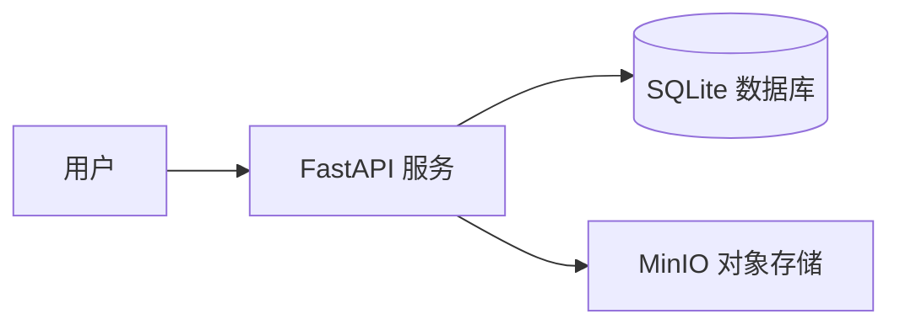

<div align="center">

# ☁️ MyCloud 私有图床
### 为创作者打造的极简、隐私、高性能图片托管服务

[](https://www.python.org/)
[](https://fastapi.tiangolo.com/)
[](https://min.io/)
[](https://www.docker.com/)
[](LICENSE)

[在线演示](https://img2.demo.test52dzhp.com/) · [快速部署](#-快速部署) · [功能特性](#-功能特性) · [问题反馈](https://github.com/qq2707149827-wq/image-url-tool/issues)


</div>

---

## 💡 为什么选择 MyCloud？

在云服务日益昂贵、隐私泄露频发的今天，**MyCloud** 致力于为您提供一个**完全可控**的图片托管方案。

- 🔒 **隐私优先**：数据存储在您自己的服务器（MinIO）上，没有大数据杀熟，没有隐私扫描。
- ⚡ **极致性能**：基于 FastAPI 异步框架，配合 SHA-256 秒传机制，上传下载快如闪电。
- 🎨 **极简体验**：没有广告，没有复杂的仪表盘。拖拽、粘贴、复制链接，一步到位。
- 📱 **全端适配**：响应式设计，无论是 4K 显示器还是手机屏幕，体验始终如一。

---

## � 核心场景

| ✍️ Markdown 写作 | 🎨 设计素材管理 | 🤝 团队协作 |
| :--- | :--- | :--- |
| 一键生成 Markdown 格式链接，支持粘贴上传，写博客/文档的最佳伴侣。 | 支持 SVG, WebP, HEIC 等专业格式预览，设计师的私有素材库。 | 共享模式下，团队成员可共同维护图库，无需繁琐的账号注册。 |

---

## ✨ 功能特性

- **多模式上传**：支持拖拽、点击、剪贴板粘贴 (Ctrl+V)。
- **智能去重**：基于文件内容计算哈希，相同图片秒传，节省存储空间。
- **隐私/共享**：
    - 👤 **私有模式**：基于设备指纹 (Cookie) 隔离，只有你能看到自己的图。
    - 👥 **共享模式**：生成的链接所有人可见，适合团队协作。
- **历史管理**：强大的搜索、筛选、批量删除功能。
- **数据导出**：一键导出 JSON 格式元数据，方便迁移。
- **安全代理**：通过后端代理访问 MinIO，隐藏真实存储地址，解决跨域问题。

---

## �️ 快速部署

我们推荐使用 Docker Compose 进行一键部署，省去繁琐的环境配置。

### 1. 获取代码
```bash
git clone https://github.com/qq2707149827-wq/image-url-tool.git
cd image-url-tool
```

### 2. 启动服务
```bash
# 默认配置即可运行，无需修改
docker-compose up -d
```

### 3. 开始使用
打开浏览器访问：`http://localhost:8000`

> **高级配置**：如果您需要修改端口或 MinIO 密钥，请编辑 `.env` 文件（参考 `.env.example`）。

---

## � 技术架构

本项目采用前后端分离（逻辑分离，物理同构）架构，确保高性能与易维护性。

- **后端**: [FastAPI](https://fastapi.tiangolo.com/) (高性能 Python Web 框架)
- **存储**: [MinIO](https://min.io/) (S3 兼容对象存储)
- **数据库**: [SQLite](https://www.sqlite.org/) (轻量级元数据存储)
- **前端**: 原生 HTML5/CSS3/JS (无框架依赖，极致轻量)



---

## 🔐 认证系统

### 用户注册/登录
支持用户名密码注册和 Google 账号登录。

### Google OAuth 配置
1. 前往 [Google Cloud Console](https://console.cloud.google.com/apis/credentials)
2. 创建 OAuth 2.0 Client ID (Web Application)
3. 在 **Authorized JavaScript origins** 添加你的域名 (如 `http://localhost:8001`)
4. 复制 Client ID 填入 `.env` 文件的 `GOOGLE_CLIENT_ID`

### Admin 模式
管理员可以删除/重命名任何用户的图片。
```bash
# 提升用户为管理员
python tools/make_admin.py <用户名>
```

---

## 🗺️ 路线图 (Roadmap)

- [x] **用户系统**: 支持多用户注册与权限管理
- [x] **Google 登录**: 支持 Google OAuth 一键登录
- [ ] **图片处理**: 在线裁剪、压缩、加水印
- [ ] **API 开放**: 提供标准 RESTful API 供第三方工具集成
- [ ] **CDN 集成**: 支持一键接入 Cloudflare/阿里云 CDN
- [ ] **桌面客户端**: Electron 跨平台客户端

---

## 📄 许可证

本项目基于 [MIT 许可证](LICENSE) 开源。您可以免费用于个人或商业项目。

---

<div align="center">
Made with ❤️ for Creators
</div>

